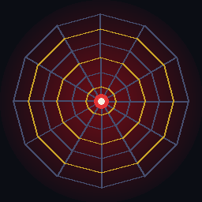

<p align="center"></p>

# Mayajaal — Web of Magic 🕸️⚡

A themed VS Code experience for a **Spider-Man fan and a Potterhead**.
मायाजाल means *"the web of magic / illusion"* in Sanskrit — a spider's web and a
wizard's spell in one word.

Built by **Kanak Prabhakar**.

## What's inside

- **A colour theme — "Mayajaal (Web & Wand)"** — a deep-night editor with
  Spidey-crimson keywords and Gryffindor-gold strings. Pick it from
  *Preferences → Color Theme*.
- **Magical welcome panel** — an animated spider-web with drifting golden
  magic-motes and a calligraphy title. Opens on first launch, or via
  *Mayajaal: Open Magical Welcome*.
- **Cast a Spell** — a status-bar 🕸️ button that drops a Potter/Spidey-flavoured
  bit of motivation. (*Mayajaal: Cast a Spell*)
- **Calligraphy banner** — insert a decorative comment banner into any file.
  (*Mayajaal: Insert Calligraphy Banner*)

## Install (locally)

```bash
# option A — package and install the .vsix
npm i -g @vscode/vsce
vsce package
code --install-extension mayajaal-1.0.0.vsix

# option B — run it live
code .        # then press F5 to launch an Extension Development Host
```

Then open the Command Palette (`Ctrl/Cmd+Shift+P`) and type **Mayajaal**.

## Commands

| Command | What it does |
|---|---|
| `Mayajaal: Open Magical Welcome` | the animated web-and-wand welcome panel |
| `Mayajaal: Cast a Spell (motivation)` | a random spell / Spidey line |
| `Mayajaal: Insert Calligraphy Banner` | a decorative comment banner |

## Built with

Pure VS Code extension API + a self-contained Canvas animation. No build step,
no runtime dependencies.

## License

MIT © 2026 Kanak Prabhakar — see [`LICENSE`](LICENSE).

## जादू — typing effects

Writing code should feel like something is happening. As you type, a small mark
appears beside the cursor and a streak counter runs in the status bar. Keep
going without stopping or deleting and you hit milestones:

| streak | |
|---:|---|
| 25 | ✨ रंगोली बन रही है |
| 50 | 🥁 ढोल बजा |
| 100 | 🎯 शतक! |
| 200 | 🪔 दीप जल उठा |
| 300 | 🔱 त्रिशूल |
| 500 | 🏹 अर्जुन का निशाना |

The streak resets when you delete, or after two and a half seconds of not
typing.

The idea comes from the "ridiculous coding" genre of extensions. None of that
code is here — the effects, the milestones and the wording are written for
Mayajaal, and they are Indian rather than generic.

### Turning it off

All of it is optional. An editor that will not stop moving is a bad editor for
most people most of the time.

| setting | |
|---|---|
| `mayajaal.jaadu.enabled` | everything off, leaving just the colour theme |
| `mayajaal.jaadu.statusBar` | the streak counter |
| `mayajaal.jaadu.cursorMarks` | the mark beside the cursor |
| `mayajaal.jaadu.milestones` | the milestone announcements |

Or run **Mayajaal: जादू चालू/बंद करो** from the command palette — clicking the
status bar item does the same.

### A note on sound

There is none. VS Code has no audio API, and the usual workaround is a hidden
webview playing media, which keeps a process alive for as long as the editor is
open. That is a poor trade for a sound effect, so Mayajaal does not do it.

## Test

```bash
npm test
```

20 checks on the streak counter, the milestones and the status-bar text. They
run on plain node — the logic is kept free of the editor API so it can be
tested without one.
